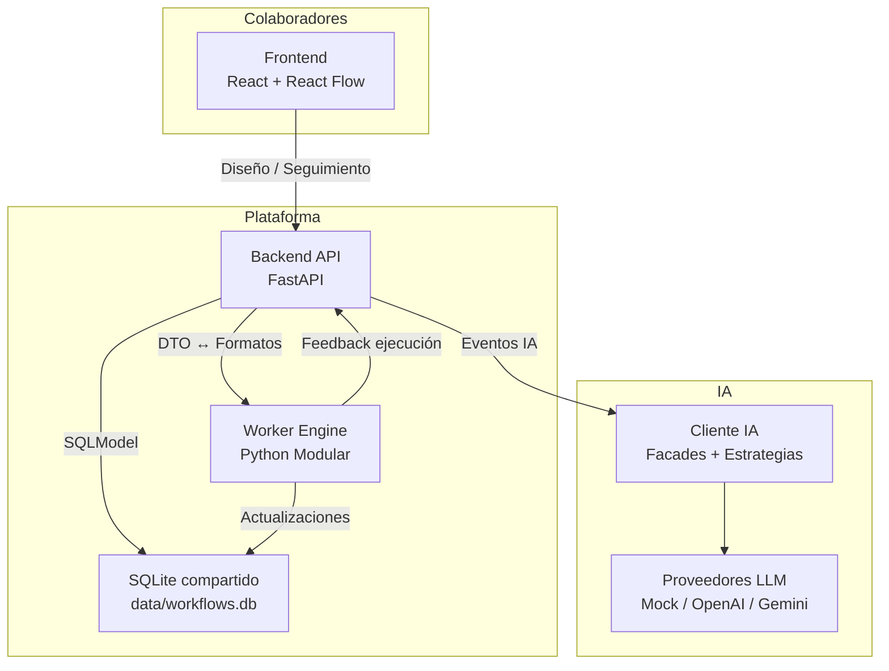
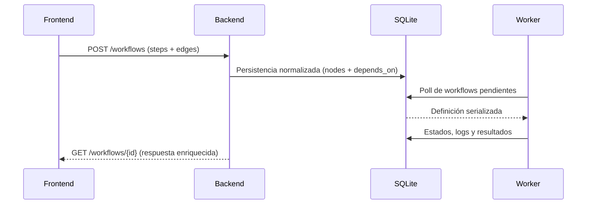

# 🧭 Plataforma Workflow AI — Visión General

Guía central del ecosistema que combina **Frontend**, **Backend** y **Worker** para diseñar, ejecutar y optimizar workflows impulsados por IA.

---

## 📋 Tabla de Contenidos
- [Qué es este proyecto](#-qué-es-este-proyecto)
- [Arquitectura Global](#-arquitectura-global)
- [Módulos y responsabilidades](#-módulos-y-responsabilidades)
- [Flujos clave](#-flujos-clave)
- [Ambientes de trabajo](#-ambientes-de-trabajo)
- [Testing y calidad](#-testing-y-calidad)
- [Roadmap compartido](#-roadmap-compartido)
- [Recursos y referencias](#-recursos-y-referencias)

---

## ✨ Qué es este proyecto

Plataforma colaborativa para orquestar procesos con tareas encadenadas, telemetría y asistencia de IA. El **Frontend** ofrece un editor visual y paneles en tiempo real; el **Backend** expone contratos REST/OpenAPI que traducen formatos y coordinan la persistencia; el **Worker** materializa la ejecución y aplica estrategias de tareas, decoradores y comandos IA.

---

## 🏗️ Arquitectura Global



- **Persistencia compartida**: `data/workflows.db` actúa como punto de sincronía entre los servicios.
- **Contratos homogéneos**: el Backend traduce `steps/edges` (Frontend) a `nodes/depends_on` (Worker).
- **Subsistema IA**: expuesto desde el Backend, ejecutado mediante comandos y estrategias en Worker e IA client.

---

## 🧩 Módulos y responsabilidades

| Módulo | Rol principal | Tecnologías | Documentación específica |
| --- | --- | --- | --- |
| Frontend | Editor visual, monitoreo y experiencia colaborativa | React 19, Vite, Tailwind, React Flow | `Frontend/README.md` |
| Backend | API pública, orquestación, validaciones y capa IA | FastAPI, SQLModel, Alembic, Pytest | `Backend/README.md` |
| Worker | Ejecutor de workflows y catálogo de tareas | Python 3, Strategy/Command/Decorator, SQLite | `Worker/Documentacion/README.md` |

- Cada módulo mantiene su propio `README` con instalación y comandos detallados.
- El diseño permite ciclos de despliegue independientes con contratos compartidos mediante OpenAPI y modelos SQLModel.

---

## 🔄 Flujos clave

### Ciclo de diseño → ejecución



- **Sugerencias IA**: el Frontend solicita optimizaciones/fixes al Backend (`/ia/*`), que delega en el subsistema IA y Worker para aplicar cambios o estimaciones.
- **Observabilidad**: logs y estados se centralizan en la base compartida; el Frontend los muestra con auto-refresh y filtros.

---

## 🛠️ Ambientes de trabajo

1. **Requisitos básicos**
   - Python 3.11+ y entorno virtual (para Backend/Worker).
   - Node.js 18+ (para Frontend).
   - SQLite disponible (se crea automáticamente en `data/`).

2. **Lanzar la plataforma en local**
   ```bash
   # Terminal 1 - Backend
   cd Backend
   uvicorn src.main:app --reload --port 8000

   # Terminal 2 - Worker
   cd Worker
   # Sigue el README del Worker para inicializar el motor (WorkflowEngine / cli)

   # Terminal 3 - Frontend
   cd Frontend
   npm install
   npm run dev
   ```

   - El Frontend apunta a `VITE_API_URL=http://localhost:8000`.
   - `VITE_USE_MOCK=true` permite trabajar sin Backend mientras se desarrolla.

3. **Variables de entorno compartidas**
   - APIs IA configurable mediante `IA_PROVIDER` y llaves en Backend.
   - Tokens mock y credenciales definidos para pruebas locales (`POST /login`).

---

## 🧪 Testing y calidad

- **Backend**: suites de `pytest` para endpoints, repositorios y subsistema IA (`Backend/tests`).
- **Worker**: pruebas unitarias y de integración (`Worker/Tests`) con cobertura y escenarios parametrizados.
- **Frontend**: Vitest para componentes, hooks y servicios, con modo mock para contratos.
- **Integración**: contratos REST se detallan en el OpenAPI del Backend; usarlo como fuente de verdad al sincronizar cambios entre módulos.

---

## 🗺️ Roadmap compartido

- Consolidar autenticación real end-to-end (Frontend ↔ Backend ↔ Worker).
- Unificar métricas y monitoreo (exponer eventos Worker vía Backend para dashboards).
- Exponer ejecuciones del Worker mediante WebSockets o colas para mejorar feedback en tiempo real.
- Desacoplar proveedores IA reales y mocks detrás de configuraciones de entorno comúnes.

---

## 📚 Recursos y referencias

- Documentación específica por módulo:
  - Frontend: `Frontend/README.md`
  - Backend: `Backend/README.md`
  - Worker: `Worker/Documentacion/README.md`
- Base de datos compartida: `data/workflows.db` (esquema detallado en `Backend/BD_DISENIO.md`).
- Roadmap granular y tareas pendientes: consultar `TODOs.md`.

---

➡️ Para información operativa o contribuciones, revisa el README correspondiente al módulo y sincroniza cambios de contratos en conjunto con el equipo.
