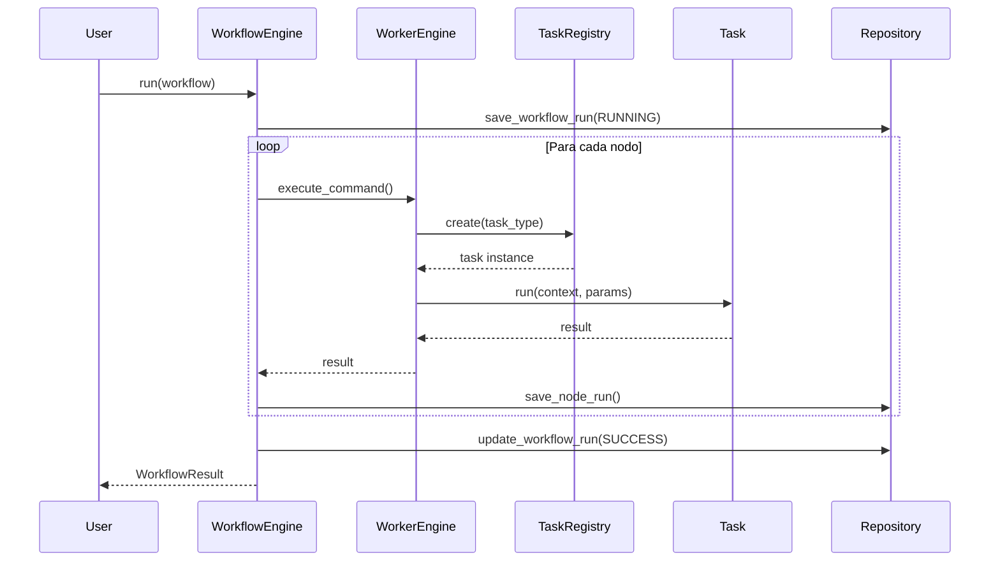

Sistema modular y extensible para la ejecución de workflows con tareas configurables, diseñado con patrones de diseño robustos (Strategy, Command, Decorator, Factory).

## 📋 Tabla de Contenidos

- [Características](#-características)
- [Arquitectura](#-arquitectura)
- [Instalación](#-instalación)
- [Uso Rápido](#-uso-rápido)
- [Estructura del Proyecto](#-estructura-del-proyecto)
- [Componentes Principales](#-componentes-principales)
- [Crear Tareas Personalizadas](#-crear-tareas-personalizadas)
- [Tests](#-tests)
- [Roadmap](#-roadmap)

---

## ✨ Características

- **Orquestación de Workflows**: Ejecuta flujos de trabajo con dependencias entre tareas
- **Sistema de Tareas Pluggable**: Añade nuevas tareas sin modificar el core
- **Persistencia Automática**: Guarda el historial de ejecuciones en SQLite
- **Decoradores Configurables**: Añade logging, timing y otras funcionalidades cross-cutting
- **Manejo Robusto de Errores**: Gestión de fallos con recuperación parcial
- **Validación de Parámetros**: Valida inputs antes de la ejecución
- **Tests Automatizados**: Suite completa de tests con pytest

---

## 🏗️ Arquitectura

### Patrones de Diseño Implementados

```
┌─────────────────────────────────────────────────────────────┐
│                      WorkflowEngine                          │
│  (Orquestador de flujos con dependencias)                   │
└────────────────────┬────────────────────────────────────────┘
                     │
                     ▼
┌─────────────────────────────────────────────────────────────┐
│                     WorkerEngine                             │
│  (Ejecutor de comandos individuales)                        │
└────────────────────┬────────────────────────────────────────┘
                     │
                     ▼
┌─────────────────────────────────────────────────────────────┐
│                    TaskRegistry (Factory)                    │
│  (Catálogo de tareas disponibles)                           │
└────────────────────┬────────────────────────────────────────┘
                     │
                     ▼
┌─────────────────────────────────────────────────────────────┐
│              ITask (Strategy Pattern)                        │
│  ┌──────────┬──────────┬──────────┬──────────┬──────────┐  │
│  │HttpGet   │ValidateCSV│Transform│SaveDB    │Notify    │  │
│  └──────────┴──────────┴──────────┴──────────┴──────────┘  │
└─────────────────────────────────────────────────────────────┘
                     │
                     ▼
┌─────────────────────────────────────────────────────────────┐
│              Decorators (Decorator Pattern)                  │
│  TimeDecorator, LoggingDecorator                            │
└─────────────────────────────────────────────────────────────┘
```

### Flujo de Ejecución



---

## 📦 Instalación

### Requisitos

- Python 3.9+
- pip

### Instalación de Dependencias

```bash
# Clonar el repositorio
git clone https://github.com/tu-usuario/worker-engine.git
cd worker-engine

# Crear entorno virtual
python -m venv venv
source venv/bin/activate  # En Windows: venv\Scripts\activate

# Instalar dependencias
pip install -r requirements.txt
```

### `requirements.txt`

```txt
sqlmodel>=0.0.14
sqlalchemy>=2.0.0
pandas>=2.0.0
requests>=2.31.0
pytest>=7.4.0
pytest-cov>=4.1.0
```

---

## 🚀 Uso Rápido

### 1. Definir un Workflow (JSON)

```json
{
  "name": "Procesamiento de Datos",
  "nodes": [
    {
      "id": "validar",
      "type": "validate_csv",
      "params": {
        "path": "data/input.csv",
        "columns": ["id", "nombre", "edad"]
      }
    },
    {
      "id": "transformar",
      "type": "transform_simple",
      "depends_on": ["validar"],
      "params": {
        "input_path": "data/input.csv",
        "output_path": "data/output.csv",
        "select_columns": ["id", "nombre"]
      }
    },
    {
      "id": "guardar",
      "type": "save_db",
      "depends_on": ["transformar"],
      "params": {
        "path": "data/output.csv",
        "table": "usuarios",
        "mode": "replace"
      }
    }
  ]
}
```

### 2. Ejecutar el Workflow

```python
from Worker.workflow.workflow_engine import WorkflowEngine
from Worker.workflow.workflow_models import WorkflowDefinition
from Worker.workflow.workflow_persistence import WorkflowRepository
from Worker.worker_engine import WorkerEngine
from Worker.factory import Taskregistry
from Worker.strategies.validate_csv import ValidateCSVTask
from Worker.strategies.transform_simply import TransformSimpleTask
from Worker.strategies.save_db import SaveDBTask
import json

# 1. Inicializar componentes
registry = Taskregistry()
registry.register(ValidateCSVTask)
registry.register(TransformSimpleTask)
registry.register(SaveDBTask)

worker = WorkerEngine(registry)
repo = WorkflowRepository(db_path="data/workflows.db")
engine = WorkflowEngine(worker=worker, repo=repo)

# 2. Cargar workflow
with open("workflows/procesamiento.json", "r") as f:
    workflow_data = json.load(f)

workflow = WorkflowDefinition.from_dict(workflow_data)

# 3. Ejecutar
result = engine.run(workflow)

# 4. Ver resultado
print(f"Estado: {result.status}")
print(f"Resultados: {result.results}")
```

### Salida Esperada

```
[WorkflowEngine] ▶️ Ejecutando workflow: Procesamiento de Datos
[Worker] ▶️ Ejecutando validate_csv (node=validar, run=Procesamiento de Datos_validar)
[ValidateCSVTask] ✅ Finalizada en 0.023s
[Worker] ✅ Tarea 'validate_csv' completada

[Worker] ▶️ Ejecutando transform_simple (node=transformar, run=Procesamiento de Datos_transformar)
[TransformSimpleTask] ✅ Finalizada en 0.045s
[Worker] ✅ Tarea 'transform_simple' completada

[Worker] ▶️ Ejecutando save_db (node=guardar, run=Procesamiento de Datos_guardar)
[SaveDBTask] 2 filas insertadas en la tabla 'usuarios'.
[SaveDBTask] ✅ Finalizada en 0.012s
[Worker] ✅ Tarea 'save_db' completada

[WorkflowEngine] 🏁 Workflow completado: Procesamiento de Datos con estado SUCCESS
Estado: SUCCESS
```

---

## 📁 Estructura del Proyecto

```
Proyecto U2/
└── Worker/
    ├── __init__.py
    ├── worker_engine.py          # Motor de ejecución de tareas
    ├── factory.py                # Registry de tareas (Factory Pattern)
    ├── Task_command.py           # Command Pattern
    ├── decorador.py              # Decoradores (Decorator Pattern)
    │
    ├── config/
    │   └── decoradores_config.py # Configuración de decoradores por tarea
    │
    ├── strategies/               # Tareas concretas (Strategy Pattern)
    │   ├── base.py              # Interfaz ITask
    │   ├── Http_get.py
    │   ├── validate_csv.py
    │   ├── transform_simply.py
    │   ├── save_db.py
    │   └── notify_mock.py
    │
    ├── workflow/                 # Sistema de workflows
    │   ├── workflow_engine.py   # Orquestador
    │   ├── workflow_models.py   # Modelos de dominio
    │   └── workflow_persistence.py # Persistencia en BD
    │
    ├── planner/                  # Planificador AI (futuro)
    │   ├── interfaces.py
    │   ├── mock_provider.py
    │   └── planner_facade.py
    │
    └── Tests/                    # Suite de tests
        ├── test_planner_facade.py
        ├── test_worker_tasks.py
        ├── test_workflow_engine.py
        └── seeds/                # Datos de prueba
            ├── sample.csv
            ├── workflow_csv.json
            └── workflow_http.json
```

---

## 🧩 Componentes Principales

### 1. WorkflowEngine

Orquesta la ejecución de workflows con dependencias entre tareas.

**Responsabilidades:**
- Resolver dependencias entre nodos
- Ejecutar tareas en orden correcto
- Manejar fallos parciales (PARTIAL_SUCCESS)
- Persistir estado de ejecución

```python
class WorkflowEngine:
    def run(self, workflow: WorkflowDefinition) -> WorkflowResult:
        """Ejecuta un workflow completo"""
```

### 2. WorkerEngine

Ejecuta comandos individuales aplicando decoradores.

**Responsabilidades:**
- Instanciar tareas desde el registry
- Aplicar decoradores configurados
- Ejecutar y capturar resultados
- Manejar errores

```python
class WorkerEngine:
    def execute_command(self, command: TaskCommand, context=None):
        """Ejecuta un comando individual"""
```

### 3. TaskRegistry (Factory)

Catálogo centralizado de tareas disponibles.

```python
registry = Taskregistry()
registry.register(HttpGetTask)
registry.register(ValidateCSVTask)

# Crear instancia
task = registry.create("validate_csv")
```

### 4. ITask (Strategy Pattern)

Interfaz base para todas las tareas.

```python
class ITask(ABC):
    def execute(self, context, params) -> dict:
        """Lógica principal"""
        
    def validate_params(self, params) -> bool:
        """Validación de parámetros"""
        
    def run(self, context, params):
        """Template Method"""
```

### 5. WorkflowRepository

Gestiona la persistencia de workflows y resultados.

**Modelos:**
- `WorkflowRun`: Registro de ejecución de workflow
- `NodeRun`: Registro de ejecución de nodo individual

---

## 🔧 Crear Tareas Personalizadas

### Paso 1: Crear la clase

```python
# Worker/strategies/mi_tarea.py
from Worker.strategies.base import ITask

class MiTareaCustom(ITask):
    type = "mi_tarea"  # Identificador único
    display_name = "Mi Tarea Custom"
    description = "Descripción de lo que hace"
    category = "Procesamiento"
    icon = "zap"
    
    params_schema = {
        "type": "object",
        "properties": {
            "input": {"type": "string", "title": "Input"},
            "config": {"type": "number", "title": "Config"}
        },
        "required": ["input"]
    }
    
    def validate_params(self, params):
        if "input" not in params:
            raise ValueError("Falta el parámetro 'input'")
    
    def execute(self, context, params):
        # Tu lógica aquí
        result = self.procesar(params["input"])
        
        return {
            "success": True,
            "output": result
        }
    
    def procesar(self, input_data):
        # Implementación
        return input_data.upper()
```

### Paso 2: Registrar la tarea

```python
from Worker.strategies.mi_tarea import MiTareaCustom

registry = Taskregistry()
registry.register(MiTareaCustom)
```

### Paso 3: Usar en un workflow

```json
{
  "name": "Test Custom Task",
  "nodes": [
    {
      "id": "custom1",
      "type": "mi_tarea",
      "params": {
        "input": "hello world",
        "config": 42
      }
    }
  ]
}
```

---

## 🧪 Tests

### Ejecutar todos los tests

```bash
pytest Worker/Tests/ -v
```

### Ejecutar con cobertura

```bash
pytest Worker/Tests/ --cov=Worker --cov-report=html
```

### Tests disponibles

- **`test_worker_tasks.py`**: Tests unitarios de tareas individuales
- **`test_workflow_engine.py`**: Tests de integración de workflows
- **`test_planner_facade.py`**: Tests del planificador AI

### Ejemplo de test

```python
def test_validate_csv_success():
    task = ValidateCSVTask()
    result = task.execute(
        context={},
        params={
            "path": "tests/seeds/sample.csv",
            "columns": ["id", "nombre", "edad"]
        }
    )
    
    assert result["valid"] == True
    assert result["rows"] > 0
```

---

## 🗺️ Roadmap

### ✅ Completado (v1.0)
- [x] Sistema de tareas con Strategy Pattern
- [x] Orquestación de workflows
- [x] Persistencia en SQLite
- [x] Decoradores (Time, Logging)
- [x] Suite de tests completa
- [x] Manejo de dependencias

### 🚧 En Progreso (v1.1)
- [ ] API REST con FastAPI
- [ ] Dashboard web con React
- [ ] Editor visual de workflows
- [ ] Integración con LLM para generación de workflows

### 📅 Futuro (v2.0)
- [ ] Ejecución paralela de tareas
- [ ] Sistema de colas con Celery
- [ ] Monitoreo y alertas
- [ ] Integración con Docker
- [ ] Conectores para servicios cloud (AWS, GCP, Azure)

---

## 📝 Licencia

MIT License - Ver archivo `LICENSE` para más detalles.

---

## 👥 Contribuciones

¡Las contribuciones son bienvenidas! Por favor:

1. Fork el proyecto
2. Crea una rama para tu feature (`git checkout -b feature/nueva-funcionalidad`)
3. Commit tus cambios (`git commit -am 'Añade nueva funcionalidad'`)
4. Push a la rama (`git push origin feature/nueva-funcionalidad`)
5. Crea un Pull Request

---

## 📧 Contacto

**Autor**: [Tu Nombre]
**Email**: tu.email@ejemplo.com
**GitHub**: [@tu-usuario](https://github.com/tu-usuario)

---

⭐ Si este proyecto te fue útil, ¡dale una estrella en GitHub!
